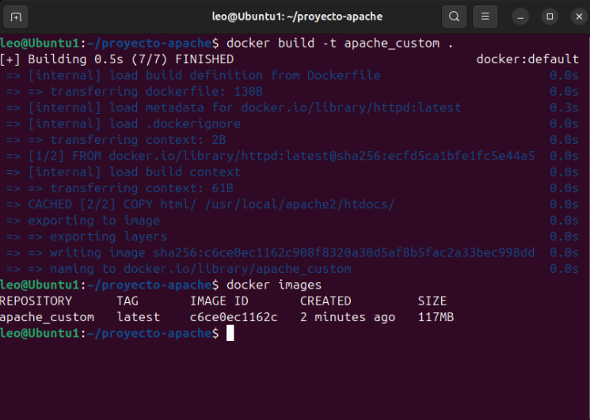
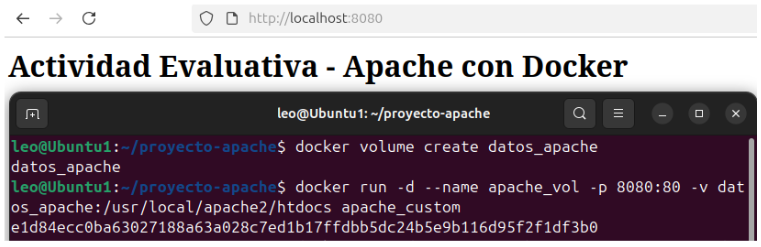
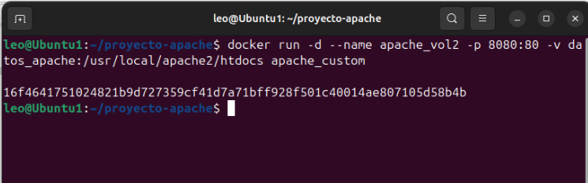

\# Actividad Evaluativa - Apache con Docker y Volúmenes


\## Descripción

Implementación de un servidor Apache con Docker utilizando volúmenes persistentes para demostrar la persistencia de datos tras eliminar contenedores.


\## Estructura del Proyecto

```

proyecto-apache/

├── Dockerfile

├── html/

│   └── index.html

└── README.md

```


\## Componentes


\### Dockerfile

\- \*\*Función\*\*: Copia contenido HTML personalizado y define volumen persistente

\- \*\*Volumen\*\*: /usr/local/apache2/htdocs


\### Volumen Docker

\- \*\*Nombre\*\*: datos\_apache

\- \*\*Punto de montaje\*\*: /usr/local/apache2/htdocs

\- \*\*Propósito\*\*: Garantizar persistencia de datos web


\## Comandos Utilizados


\### 1. Construcción de la Imagen

```bash

docker build -t apache\_custom .

```


\### 2. Creación del Volumen

```bash

docker volume create datos\_apache

```


\### 3. Ejecución del Contenedor

```bash

docker run -d --name apache\_vol -p 8080:80 -v datos\_apache:/usr/local/apache2/htdocs apache\_custom

```


\### 4. Demostración de Persistencia


\#### Modificar contenido:

```bash

docker exec -it apache\_vol sh -c "echo '<h1>DATOS MODIFICADOS</h1>' > /usr/local/apache2/htdocs/prueba.html"

```


\#### Verificar cambio:

```bash

curl http://localhost:8080/prueba.html

```


\#### Eliminar contenedor:

```bash

docker rm -f apache\_vol

```


\#### Recrear contenedor con mismo volumen:

```bash

docker run -d --name apache\_vol2 -p 8080:80 -v datos\_apache:/usr/local/apache2/htdocs apache\_custom

```


\#### Verificar persistencia:

```bash

curl http://localhost:8080/prueba.html

```

## Capturas de Pantalla

### Construcción de la imagen


### Creación de volumen y ejecución del contenedor


### Recreación del contenedor (Persistencia)


\## Resultado

✅ Los datos persisten después de eliminar y recrear el contenedor, demostrando exitosamente la funcionalidad del volumen Docker.


\## Autores

Leonardo Gallego Rios, Karen Vanessa Restrepo Morales- Actividad Evaluativa Docker

